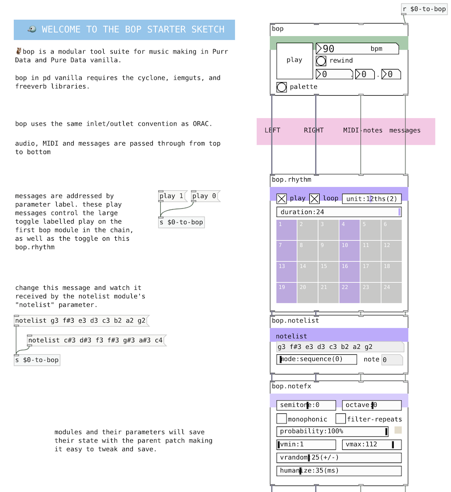

# bop-starter
A starter template for a new bop sketch.



### What is bop?
[bop](https://github.com/zealtv/bop) is a suite of digital music making modules for Purr Data and Pure Data.  It makes computerised things musical 💻+🐦=🎷.

### What are Purr Data and Pure Data?
[Pure Data](puredata.info), or PD, is visual programming environment for sound and music.  It is old, open-source, and rad.
[Purr Data](https://agraef.github.io/purr-data/) is a variant of Pure Data that includes many additional features including a modern, java-script based frontend. I recommend Purr Data in most cases unless you are a current or aspiring pd ninja.

## Step 0
Obtain a  windows, mac, or linux computer with an audio output and install [Purr Data](https://github.com/agraef/purr-data/releases) on it.
 If you know what you are doing, instead install [Pure Data](https://puredata.info/downloads/pure-data) and use Deken to install cyclone, iemguts, and freeverb.

## Step 1
open a terminal and cd to the destination directory of you project.  If in doubt, just recklessly copy and paste the following:
```
cd ~
```

## Step 2
clone this repository, including bop as a submodule.
```
git clone --recursive https://github.com/zealtv/bop-starter
```

## Step 3
Open the newly created bop-starter folder.  Open sketch001.pd in Purr Data.

(or pd vanilla + cyclone, iemguts & freeverb libraries)

**this is all pretty fresh.  expect gremlins. vanilla compatability currently dubious**

This starter makes use of samples by [Ian McCurdy](http://www.iainmccurdy.org/soundlibrary.html)[(CC-A2.0)](https://creativecommons.org/licenses/by/2.0/). 
